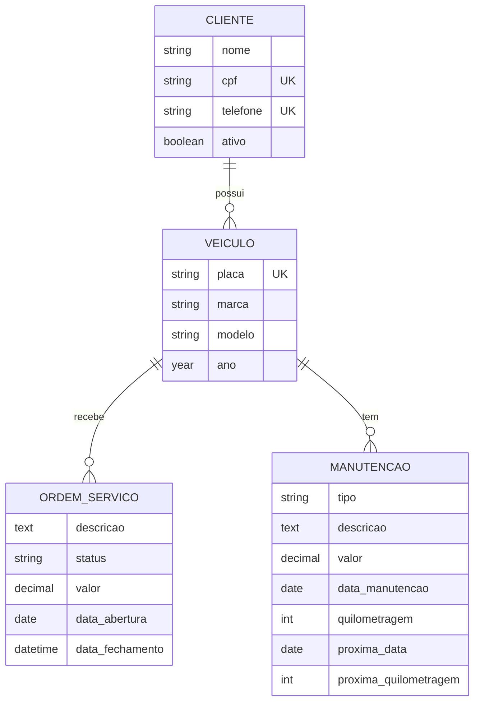
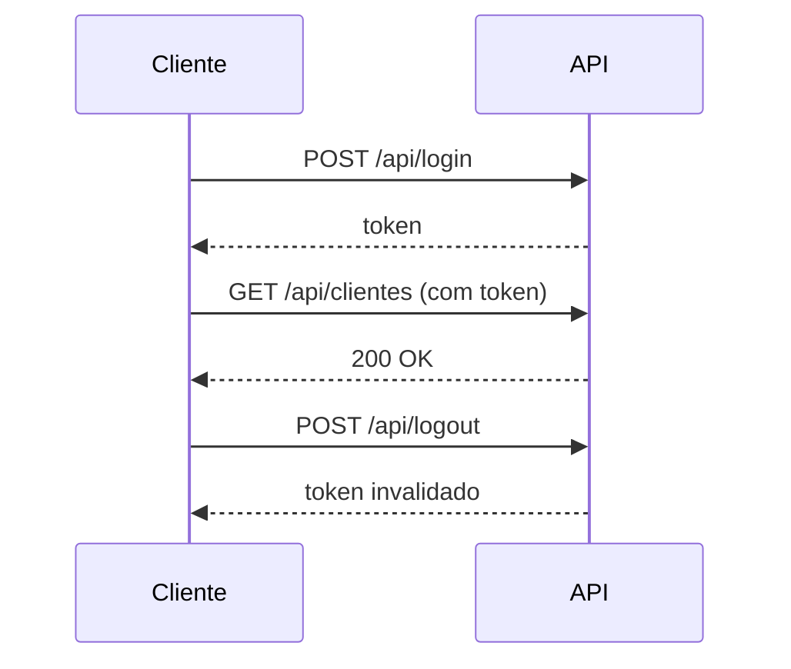

<div align="center">

# 🚗 MyCar API

### API REST para gestão de oficina mecânica

Clientes, veículos, ordens de serviço e manutenções.


**Backend** · [Ver frontend (React)](https://github.com/joaoalexandre2/mycar_frontend)

</div>

---

## 🧩 Modelo de dados



> 🗑️ Ao excluir um cliente, seus veículos são removidos; ao excluir um veículo, suas ordens de serviço e manutenções também (cascade).

## 🔐 Autenticação



Todas as rotas, exceto o login, exigem token.

## 🛣️ Endpoints

| Recurso | Método | Rota |
|---|---|---|
| 🔐 Auth | `POST` | `/api/login` |
| 🔐 Auth | `POST` | `/api/logout` |
| 🔐 Auth | `GET` | `/api/me` |
| 👥 Clientes | `GET` `POST` | `/api/clientes` |
| 👥 Clientes | `GET` `PUT` `DELETE` | `/api/clientes/{id}` |
| 🚙 Veículos | `GET` `POST` | `/api/veiculos` |
| 🚙 Veículos | `GET` `PUT` `DELETE` | `/api/veiculos/{id}` |
| 🧾 Ordens de serviço | `GET` `POST` | `/api/ordens-servico` |
| 🧾 Ordens de serviço | `GET` `PUT` `DELETE` | `/api/ordens-servico/{id}` |
| 🔧 Manutenções | `GET` `POST` | `/api/manutencoes` |
| 🔧 Manutenções | `GET` `PUT` `DELETE` | `/api/manutencoes/{id}` |

## 🚀 Começando

### Pré-requisitos

- PHP 8.2+
- Composer
- Node.js (para o build de assets)

### Instalação

```bash
git clone https://github.com/joaoalexandre2/mycar.git
cd mycar
composer setup
```

O `setup` instala as dependências, cria o `.env`, gera a chave, roda as migrations e faz o build.

<details>
<summary>Instalação manual</summary>

```bash
composer install
cp .env.example .env
php artisan key:generate
touch database/database.sqlite
php artisan migrate
npm install
```

</details>

### Executando

```bash
php artisan serve
```

A API fica em `http://localhost:8000/api`. Para subir servidor, fila, logs e Vite juntos:

```bash
composer dev
```

## 🧪 Testes

```bash
composer test
```

## 🔗 Frontend

O front-end React está em [joaoalexandre2/mycar_frontend](https://github.com/joaoalexandre2/mycar_frontend).

## 📄 Licença

MIT

---

<div align="center">
Feito com ☕ por <a href="https://github.com/joaoalexandre2">João Alexandre</a>
</div>
